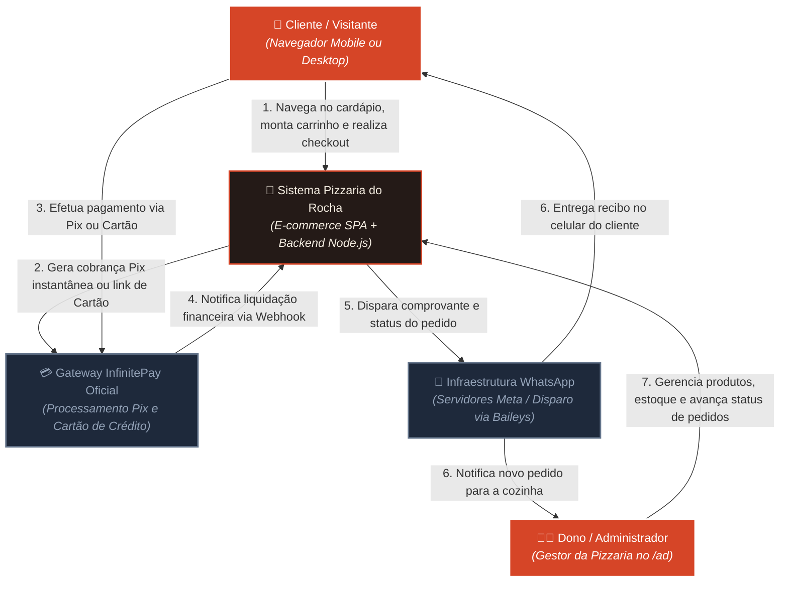
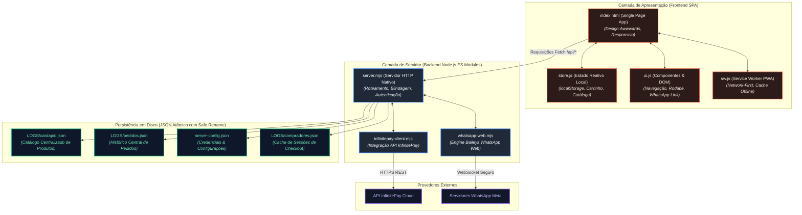
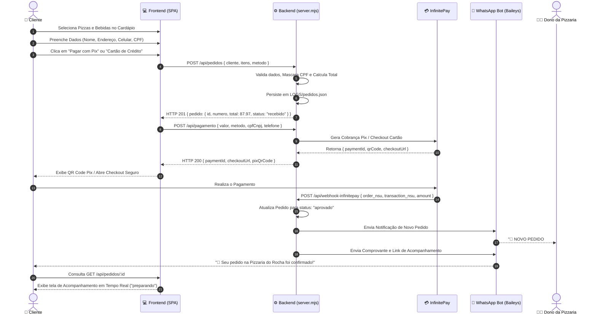
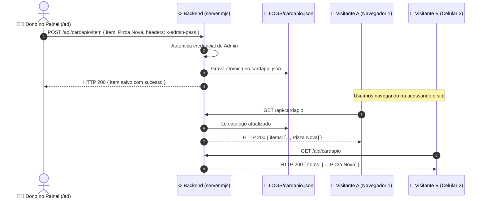
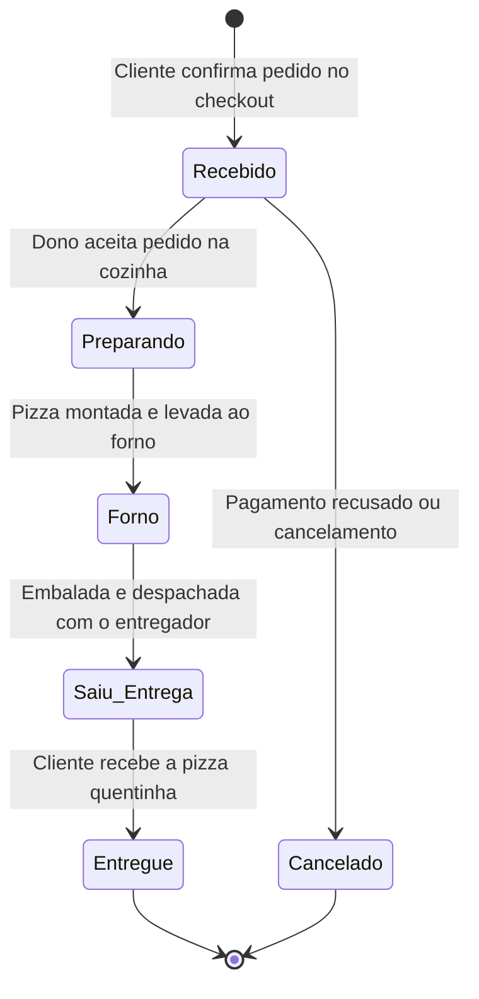
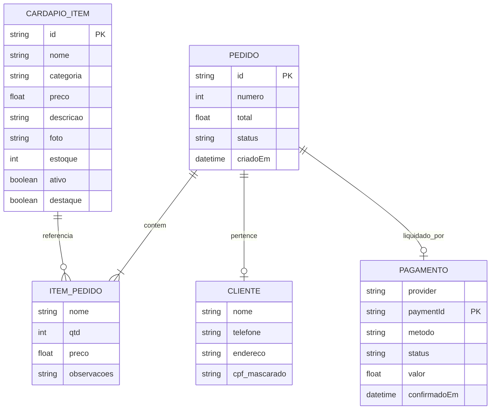

# 🍕 Pizzaria do Rocha — Arquitetura de Software & Modelagem Visual (Mermaid)

Este documento contém a modelagem arquitetural completa e detalhada do sistema **Pizzaria do Rocha**, utilizando o padrão **C4 Model** e **Mermaid.js**.

---

## 🗺️ 1. C4 Model (Nível 1) — Diagrama de Contexto do Sistema

Representa a visão geral de alto nível dos atores humanos e dos sistemas externos que interagem com a plataforma.

---

## 🏛️ 2. C4 Model (Nível 2) — Diagrama de Contêineres & Estrutura de Armazenamento

Mapeia as fronteiras de execução do software, serviços em background, APIs REST e os arquivos de persistência atômica.

---

## 🔄 3. Diagrama de Sequência E2E — Fluxo Completo de Compra & Pagamento

Demonstra a ordem temporal exata das trocas de mensagens entre Cliente, Frontend, Backend, InfinitePay e WhatsApp.

---

## 🔄 4. Diagrama de Sequência — Sincronização do Cardápio Multi-Clientes

Demonstra como as alterações feitas pelo dono no painel administrativo propagam instantaneamente para todos os visitantes.

---

## ⚙️ 5. Diagrama de Máquina de Estados — Ciclo de Vida dos Pedidos

Mapeia as transições válidas de status de um pedido no restaurante.

---

## 🗄️ 6. Diagrama Entidade-Relacionamento (Modelo de Dados)

Estrutura dos objetos manipulados pelo sistema.

